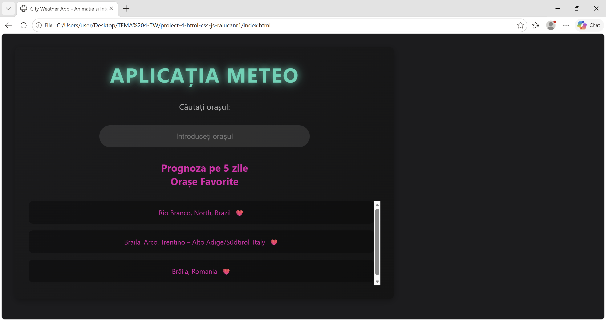
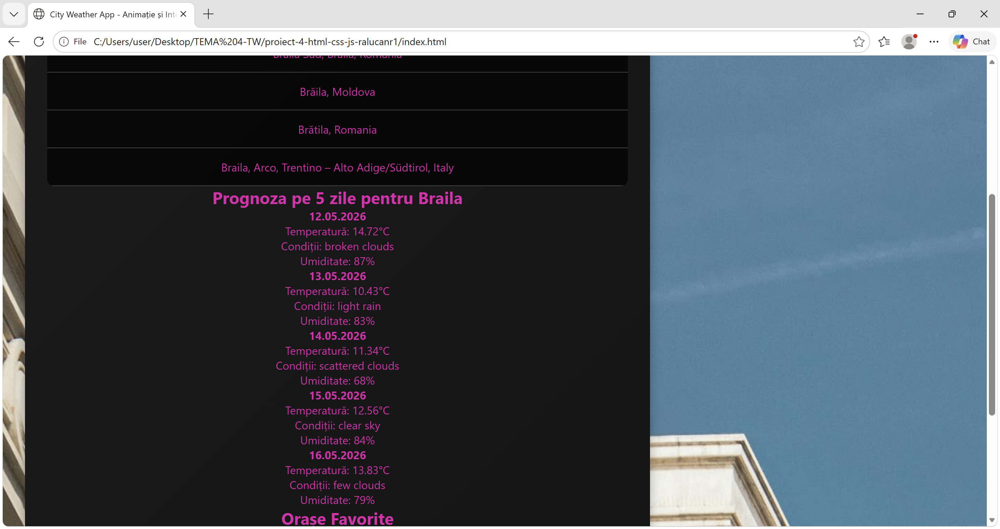

# Weather Viewer Application 🌤️

## Descriere

Weather Viewer Application este o aplicație web care permite utilizatorilor să caute un oraș și să vizualizeze informații despre vreme în timp real. Aplicația oferă o interfață modernă și intuitivă, împreună cu sugestii automate pentru căutarea orașelor și imagini reprezentative pentru locația selectată.

## Funcționalități

🔍 Căutare oraș după nume

✨ Autocomplete pentru sugestii de orașe

🌡️ Afișarea temperaturii curente

☁️ Afișarea condițiilor meteo

💨 Afișarea vitezei vântului

💧 Afișarea umidității

🖼️ Fundal dinamic în funcție de oraș

📱 Design responsive pentru desktop și mobile

## Tehnologii folosite

- HTML5

- CSS3

- JavaScript

- Fetch API

- JSON

- Weather API

## Ce am învățat:

- Prin realizarea acestui proiect am învățat:

- Cum se fac request-uri GET folosind Fetch API

- Cum se preiau date dintr-un API

- Cum se lucrează cu date JSON

- Cum se manipulează DOM-ul folosind JavaScript

- Cum se creează o interfață interactivă și responsive

## Cerințe proiect

- Tot conținutul aplicației este generat din JavaScript

- Datele despre vreme sunt preluate dintr-un API extern

- Utilizatorul poate căuta orașe folosind autocomplete

## API utilizat

Aplicația utilizează un API meteo pentru obținerea datelor despre vreme, precum:

OpenWeatherMap API sau WeatherAPI sau Open-Meteo API

## Structura proiectului
```
weather-viewer-application/
│
├── index.html
├── style.css
├── script.js
└── assets/
```





